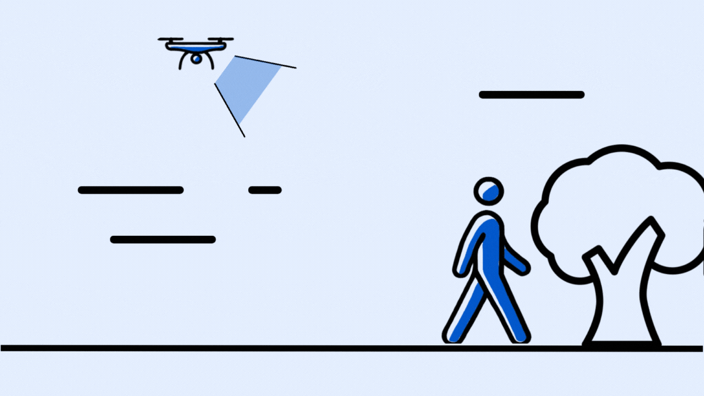
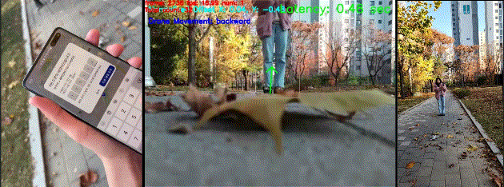
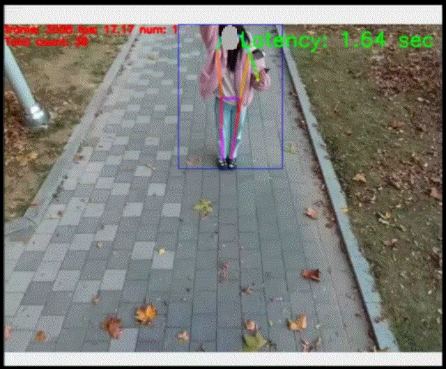
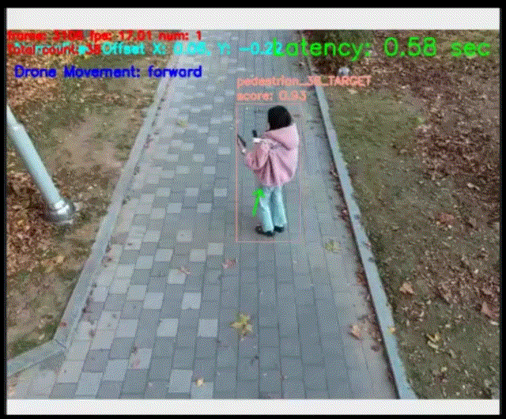
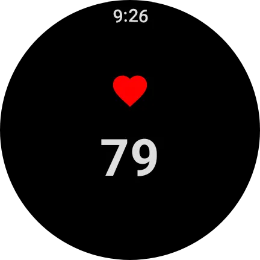
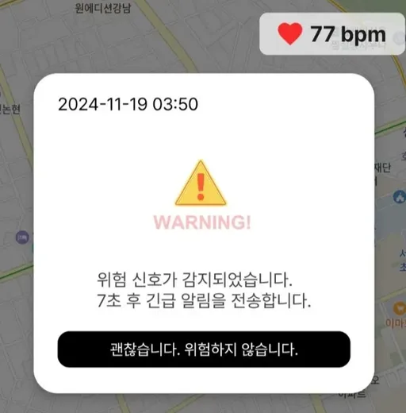
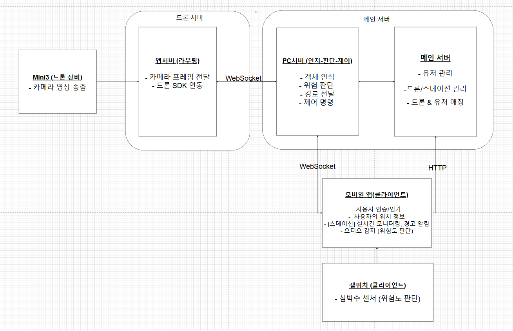

# [객체 인식을 통한 추종 자율 주행 드론을 이용한 안전 귀가 서비스] WINGWING

### Samsung Software Academy For Youth 11th - 자율 프로젝트 1등 수상 🏅

> 2024.10.14 ~ 2024.11.19 (5주)

 

1. [**서비스 소개**](#-서비스-소개)
2. [**주요 기능**](#-주요-기능)
3. [**기술 스택**](#-기술-스택)
4. [**시스템 아키텍쳐**](#-시스템-아키텍쳐)
5. [**프로젝트 파일구조**](#-프로젝트-파일-구조)
6. [**개발 팀 소개**](#-개발-팀-소개)
7. [**산출물**](#-산출물)

 

 

## ✨ [1] 서비스 소개

### **[드론을 활용한 귀가 동행 서비스]**

사용자 탐지 및 추적, 위험 상황 감지, 실시간 안전 모니터링, 비상 시 자동 신고 기능 등을 통해 안전한 귀가를 지원하는 스마트 치안 서비스

 

## 💡 [2] 주요 기능

### **1. 사용자 탐지 및 추적**

   

- 사용자는 안심귀가 드론을 배정받고 특정 행동을 통해 드론이 사용자를 탐지합니다.
- 드론은 탐지된 사용자를 추적하여 자율적으로 제어합니다.

### **2. 위험 상황 감지 및 실시간 모니터링**

      

- 사용자에게 빠르게 다가오는 타인, 이상 소음, 이상 심박수를 모바일 기기와 워치 앱 간의 데이터로 종합적으로 판단하여 위험 상황을 감지합니다.

### **3. 비상 프로세스**

 

- 위험 상황이 감지될 때 지정된 보호자에게 긴급 메시지를 전송하고 비상 사이렌을 재생합니다.

 

## 🔨 [3] 기술 스택 (version 포함)

### **Front-end**

- 언어: Kotlin
- 프레임워크/라이브러리: Compose Multiplatform, AndroidX Core KTX, Material Components, ConstraintLayout, Compose Foundation, Compose Material, Compose BOM, Activity Compose, Horologist, Tiles 및 Watchface 라이브러리
- 스타일링: Jetpack Compose
- 빌드 도구: Gradle

### **Back-end**

- 언어: Java
- 프레임워크: Spring Boot
- 데이터베이스: MySQL
- 빌드 도구: Gradle
- 테스트: Junit5
- WebSocket 기반 API 개발

### **Infra**

- EC2, Jenkins, Docker compose

### **Tools**

- 버전 관리: GitLab
- 프로젝트 관리: Jira, 간트차트, Notion

### **Version 정보**

| Back-end (Spring Boot)                            | Version     | Front-end (Android)            | Version | 드론 (앱 서버)        | Version          |
| ------------------------------------------------- | ----------- | ------------------------------ | ------- | --------------------- | ---------------- |
| Spring Boot                                       | 3.3.5       | org.jlleitschuh.gradle.ktlint  | 12.1.0  | DJI SDK Version       | V5               |
| io.spring.dependency-management                   | 1.1.6       | com.google.dagger.hilt.android | 2.48    | MSDK Version          | 5.10.0           |
| org.asciidoctor.jvm.convert                       | 3.3.2       | org.jetbrains.kotlin.kapt      | 1.8.10  | Android Studio        | Giraffe 2022.3.1 |
| Java                                              | 21          |                                |         | Java Runtime          | 17               |
| net.nurigo:sdk                                    | 4.3.0       |                                |         | Kotlin                | 1.7.21           |
| io.jsonwebtoken:jjwt-api                          | 0.12.6      |                                |         | Gradle                | 7.6.2            |
| org.springdoc:springdoc-openapi-starter-webmvc-ui | 2.6.0       |                                |         | Android Gradle Plugin | 7.4.2            |
| io.jsonwebtoken:jjwt-impl                         | 0.12.6      |                                |         | OpenCV module version | 4.6.0            |
| io.jsonwebtoken:jjwt-jackson                      | 0.12.6      |                                |         |                       |                  |
| lombok                                            | 1.18.34     |                                |         |                       |                  |
| Ubuntu (스테이션 서버)                            | 22.04.3 LTS |                                |         |                       |                  |

 

## 📊 [4] 시스템 아키텍쳐

 

## 📁 [5] 프로젝트 파일 구조

프로젝트 파일 구조

프로젝트는 다음과 같은 주요 디렉터리로 구성됩니다.

- **shieldrone-main-server**: 메인 서버 (Spring Boot)
  - `gradle/wrapper`: Gradle Wrapper 설정
  - `src`: 소스 코드
  - `.gitattributes`, `.gitignore`: Git 관련 설정
  - `build.gradle`: 빌드 설정
  - `Dockerfile`: Docker 설정
  - `gradlew`, `gradlew.bat`: Gradle 실행 스크립트
  - `settings.gradle`: 프로젝트 설정
- **shieldrone-station-app**: 스테이션 앱 (Android)
  - `app`: 앱 소스 코드
  - `gradle`: Gradle 설정
  - `.gitignore`: Git 관련 설정
  - `build.gradle`, `gradle.properties`: 빌드 설정
  - `gradlew`, `gradlew.bat`: Gradle 실행 스크립트
  - `settings.gradle`: 프로젝트 설정
- **shieldrone-station-pc**: 스테이션 PC
  - `data`: 데이터 관련 파일
  - `models`: 모델 관련 파일
  - `src`: 소스 코드
  - `config.json`: 설정 파일
  - `README.md`: README 파일
- **shieldroneapp**: 모바일 및 웨어러블 앱 (Kotlin Multiplatform)
  - `.idea`: IDE 설정
  - `gradle`: Gradle 설정
  - `mobile`: 모바일 앱 소스 코드
  - `wear`: 웨어러블 앱 소스 코드
  - `.gitignore`: Git 관련 설정
  - `build.gradle.kts`: 빌드 설정 (Kotlin DSL)
  - `gradlew`, `gradlew.bat`: Gradle 실행 스크립트
  - `settings.gradle.kts`: 프로젝트 설정 (Kotlin DSL)

 

## 👨🏻‍💻 [6] 개발 팀 소개

|  |  |  |  |  |  |
| :----------------------------------------------------------------------------------------: | :----------------------------------------------------------------------------------------: | :-----------------------------------------------------------------------------------------: | :----------------------------------------------------------------------------------------: | :----------------------------------------------------------------------------------------: | :----------------------------------------------------------------------------------------: |
|         [강한나 @hannabananah](https://github.com/hannabananah) `FRONTEND`          |                 [김준혁 @pv104](https://github.com/pv104) `BACKEND`                 |              [박희연 @hi-react](https://github.com/hi-react) `FRONTEND`              |            [서종원 @styughjvbn](https://github.com/styughjvbn) `BACKEND`            |        [전정민 @Gutsssssssssss](https://github.com/Gutsssssssssss) `BACKEND`        |               [최소현 @soddong](https://github.com/soddong) `BACKEND`               |

 

## 📝 [7] 산출물

### 1. [요구사항항 명세서](https://www.notion.so/3612ecfff095445da906fe408c2d7cec)

### 2. [기능 명세서](https://www.notion.so/53de0dbc65834d30882970197927c9e6)

### 3. [API 명세서](https://www.notion.so/API-8d4f3d91ee2440f89b34619df7230910)

### 4. [유저플로우](https://www.notion.so/e6085edaaaa84b4c83a0c5526479c00b)
